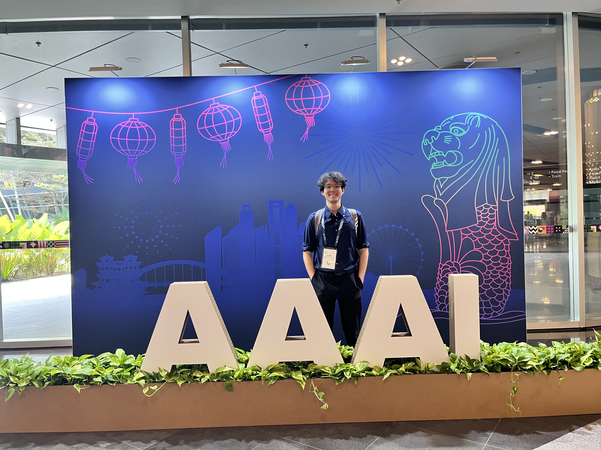
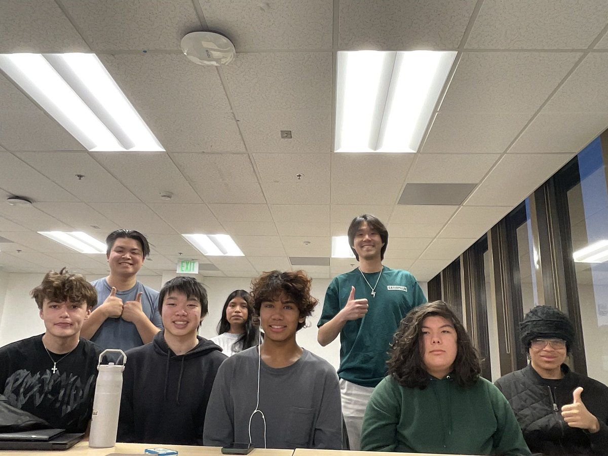
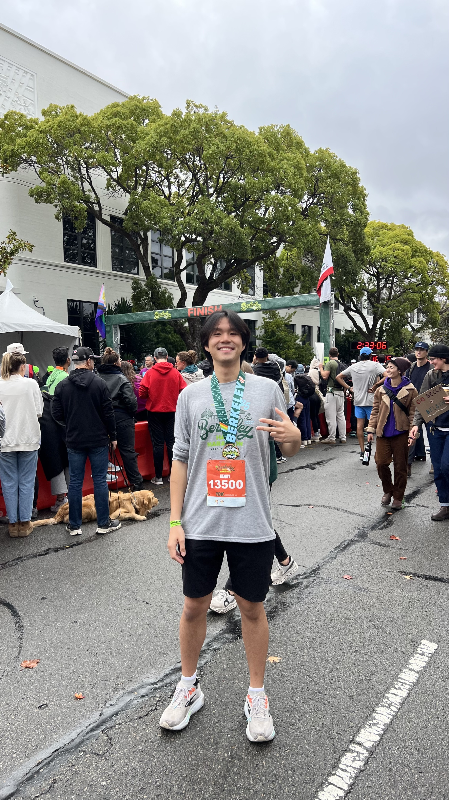

# Hobbies

Outside academics, I love teaching -- check out my [Foundations of Machine Learning (Fall 2025)](https://kennywong524.github.io/foml-fall-2025/#home) course and [others](https://kennywong524.github.io/kennywong.github.io//coursework/) I have been involved in! I'm also a big music fan; I regularly sing, play the piano and guitar with my acapella group on campus, [**Artists in Resonance (AiR)**](https://www.instagram.com/artistsinresonance/). Check out some of our performances [here](https://www.youtube.com/@ArtistsInResonance/videos?themeRefresh=1). (shameless plug :))

Being outdoor has also gradually become my pastime: hiking the [Columbia River Gorge Waterfalls](https://drive.google.com/file/d/1FHQTwDUoByfMALZF_voISsyeZZgYFGMX/view?usp=sharing) in Oregon, running the [Central Park Loop](https://drive.google.com/file/d/1wwBYRMOQZMrw8VbnTr5QRI58awod7uAX/view?usp=sharing) in New York, and watching the daily [California Sunset](https://drive.google.com/file/d/1c3r-572HvjX8nyTydSRLMGhnvlq8lkCb/view?usp=sharing) in Berkeley are some of my all-time favorites! (Follow me on [Strava](https://www.strava.com/athletes/174517136)) 

Apart from hiking and running, I love traveling to different cities in the US and studying how they are planned through maps. I'm also a huge public transit nerd. Check out some of my travel vlogs [here](https://www.youtube.com/@kennyw589).

---

## 🌏 Presenting at AAAI ’26 — my first international conference!

Still can’t believe I got to attend and present at AAAI 2026—my first international conference and a pretty surreal moment as an undergrad. I had so much fun sharing our work, getting thoughtful feedback, and meeting researchers whose papers I’ve been reading for years.

A few takeaways I’m leaving with:
- Momentum around smaller, more transparent (often open-source) models
- Growing focus on mechanistic interpretability / explainable AI
- The importance of chronology gates + human-in-the-loop ideas for high-stakes systems

Also loved reconnecting with old friends and making new ones. Kinda sad to leave this behind but I’m walking away with way more confidence and excitement for what’s next!

  
   
  <em>A photo with AAAI sign!</em>

---

## 👩‍🏫 Wrapping up Fall '25 Foundations of Machine Learning (FoML)!

Presentation day for our **Foundations of Machine Learning (FoML)** class this semester, and it was such a rewarding experience—helping students build intuition for core ML ideas without calculus!
You can check out highlights/materials **[here](https://kennywong524.github.io/foml-fall-2025/#home)**.

  
   
  <em>A few favorite moments!</em>

---

## 🏃‍♂️ First 10K!

I recently completed my **first-ever 10K race** at Berkeley Half Marathon 2025, which was an incredibly fun milestone in my running journey!  
You can check out my full run stats **[here](https://sites.chronotrack.com/event/89259/results/entry/75746426)**.

  
   
  <em>Crossing the finish line at my first 10K!</em>

