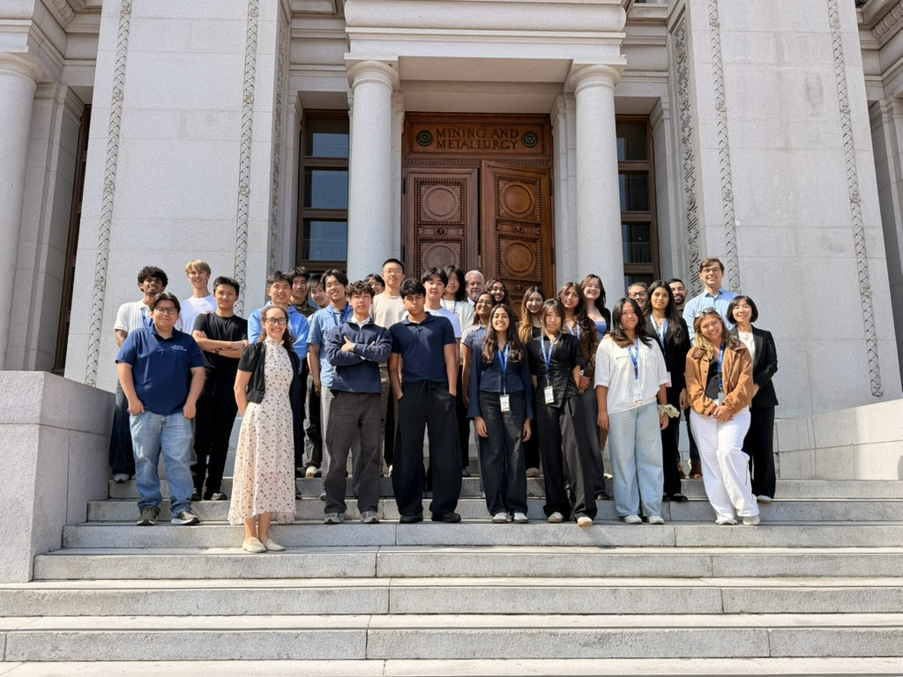
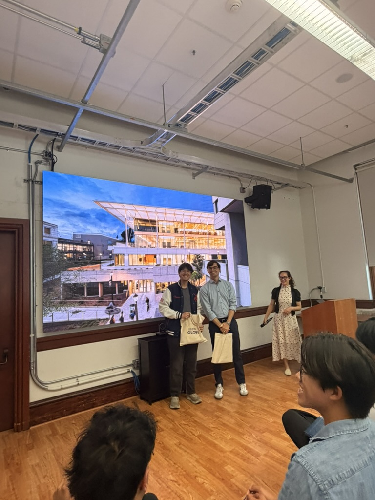
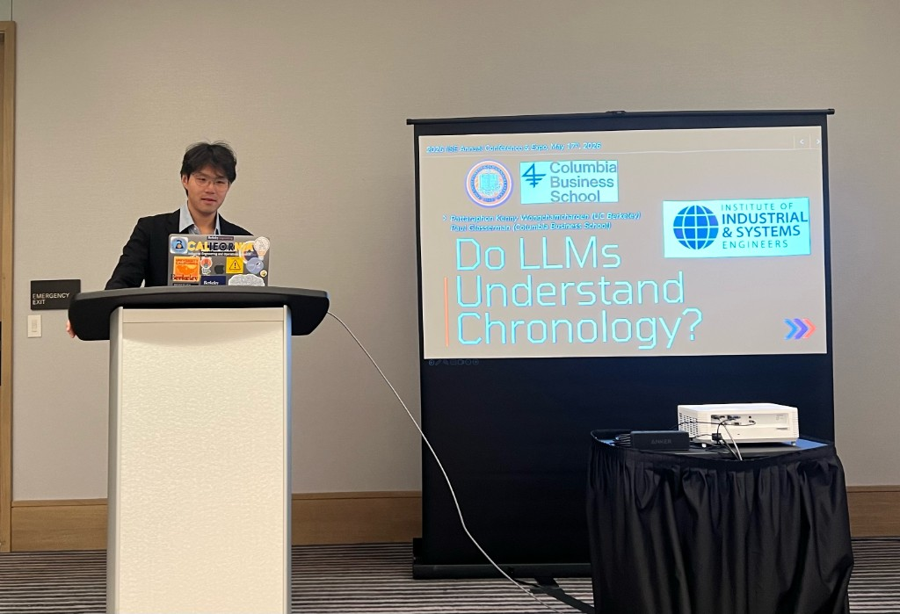
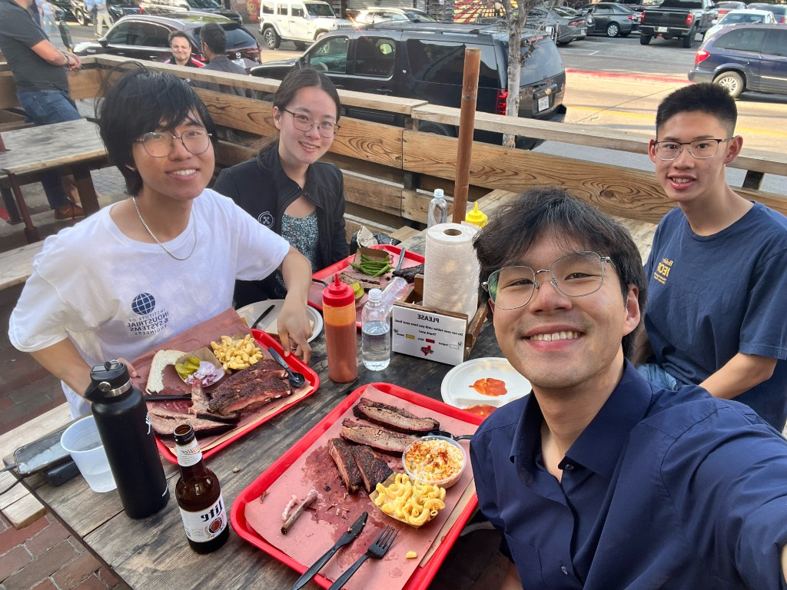
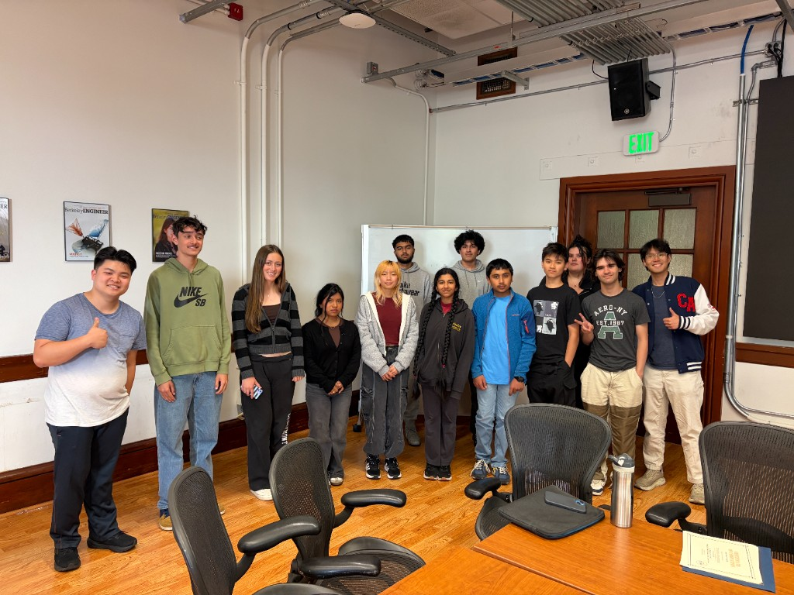
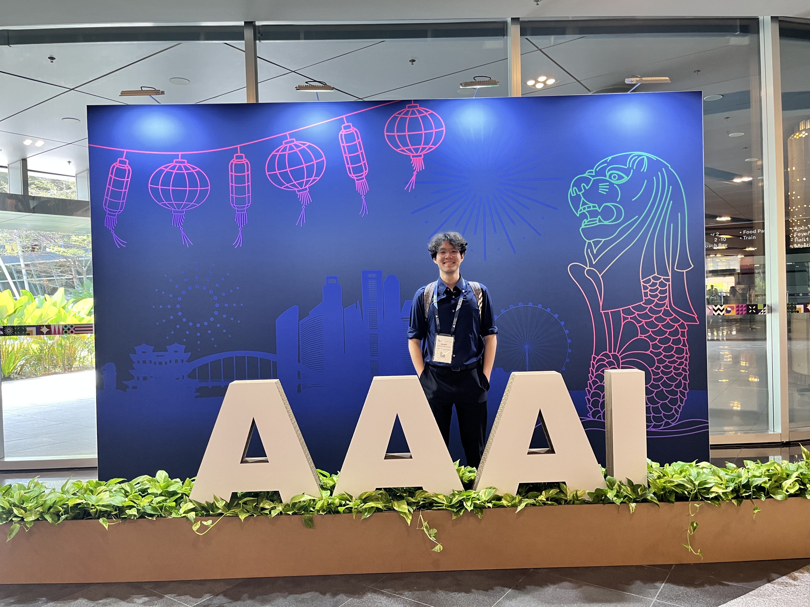
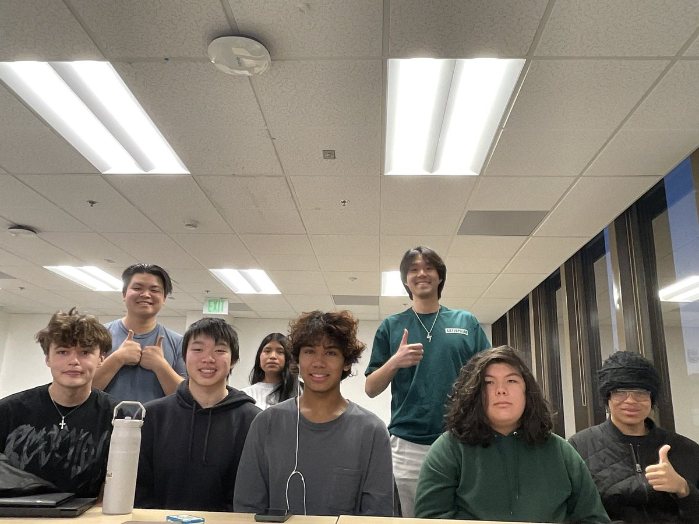
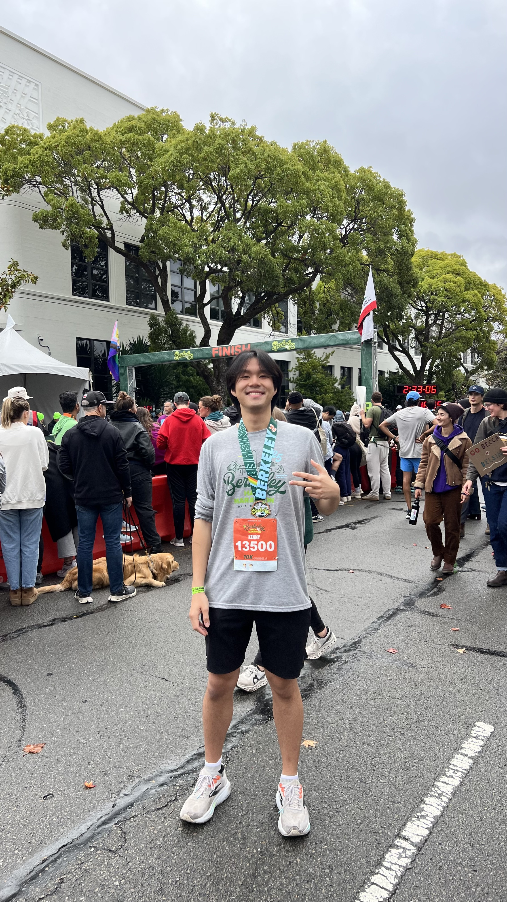

Outside academics, I love teaching -- check out my [Foundations of Machine Learning (Fall 2025)](https://kennywong524.github.io/foml-fall-2025/#home) course and [others](https://kennywong524.github.io/teaching/) I have been involved in! I'm also a big music fan; I regularly sing, play the piano and guitar with my acapella group on campus, [**Artists in Resonance (AiR)**](https://www.instagram.com/artistsinresonance/). Check out some of our performances [here](https://www.youtube.com/@ArtistsInResonance/videos?themeRefresh=1). (shameless plug :))

Being outdoor has also gradually become my pastime: hiking the [Columbia River Gorge Waterfalls](https://drive.google.com/file/d/1FHQTwDUoByfMALZF_voISsyeZZgYFGMX/view?usp=sharing) in Oregon, running the [Central Park Loop](https://drive.google.com/file/d/1wwBYRMOQZMrw8VbnTr5QRI58awod7uAX/view?usp=sharing) in New York, and watching the daily [California Sunset](https://drive.google.com/file/d/1c3r-572HvjX8nyTydSRLMGhnvlq8lkCb/view?usp=sharing) in Berkeley are some of my all-time favorites! (Follow me on [Strava](https://www.strava.com/athletes/174517136)) 

Apart from hiking and running, I love traveling to different cities in the US and studying how they are planned through maps. I'm also a huge public transit nerd. Check out some of my travel vlogs [here](https://www.youtube.com/@kennyw589).

---

## 👩‍🏫 BeSMART 2026: the best part of my summer

The best part of my summer was serving as a teaching assistant for [Berkeley Engineering Summer Machine-learning & AI Research Training (BeSMART)](https://globe.berkeley.edu/programs/summer-programs/besmart/), an AI and machine-learning summer program for high school students. I had the privilege of giving a guest lecture on my vibe-coding workflow, sharing my research, and discussing my perspectives on the future of AI.

Honestly, I may have learned more from the students than they learned from me. Their one-week machine-learning projects were remarkably ambitious and polished, and their curiosity made the future feel ridiculously bright.

Thank you to Professor [Phillip Kerger](https://phillipkerger.github.io/) for continually helping me improve my teaching and for this opportunity. I am excited to return this fall for another iteration of [Foundations of Machine Learning (FoML)](https://kennywong524.github.io/foml-fall-2025/#home).

[Read my full reflection on X](https://x.com/kennywongchamch/status/2089820123859390920?s=46&t=UOhfUEX6bTTNXChuY8VX4g) · [View my research-perspectives slides](https://kennywong524.github.io/files/BESMART-talk-2026.pdf)

  <figure class="interest-media-card">
    
    <figcaption>The BeSMART 2026 cohort outside Hearst Memorial Mining Building.</figcaption>
  </figure>
  <figure class="interest-media-card">
    
    <figcaption>Celebrating the student project presentations.</figcaption>
  </figure>

  <figure class="interest-media-card">
    <video controls playsinline preload="metadata" poster="besmart-talk-opening-poster.png" aria-label="Opening the BeSMART guest lecture">
      <source src="besmart-talk-opening.mp4" type="video/mp4">
      Your browser does not support embedded video.
    </video>
    <figcaption>Opening my guest lecture, <em>AI Is Getting Smarter... Are We Cooked?</em></figcaption>
  </figure>
  <figure class="interest-media-card">
    <video controls playsinline preload="metadata" poster="besmart-talk-research-poster.png" aria-label="Presenting research on LLM chronological reasoning">
      <source src="besmart-talk-research.mp4" type="video/mp4">
      Your browser does not support embedded video.
    </video>
    <figcaption>Sharing findings from my research on the limits of LLM chronological reasoning.</figcaption>
  </figure>

---

## 🎤 IISE Annual Conference & Expo 2026 — Arlington, TX

Had a great time presenting at the **2026 IISE Annual Conference & Expo** in Arlington, Texas. And of course — no Texas trip is complete without **Texas BBQ**. Already missing the brisket at Terry Black's!

  
  

<em>Presenting at IISE (left) · Texas BBQ with friends (right)</em>

---

## 👩‍🏫 Another iteration of FoML — Spring '26 — wrapped up!

Just finished teaching another round of **Foundations of Machine Learning (FoML)** this spring — and this time we ran our **first-ever "vibecoding" session**!
It was so rewarding to watch students, many with **no prior coding experience**, use AI to work through an entire ML pipeline / data analytics lifecycle for their final project.

  
   
  <em>Spring '26 FoML cohort on presentation day!</em>

---

## 🌏 Presenting at AAAI ’26 — my first international conference!

Still can’t believe I got to attend and present at AAAI 2026—my first international conference and a pretty surreal moment as an undergrad. I had so much fun sharing our work, getting thoughtful feedback, and meeting researchers whose papers I’ve been reading for years.

A few takeaways I’m leaving with:
- Momentum around smaller, more transparent (often open-source) models
- Growing focus on mechanistic interpretability / explainable AI
- The importance of chronology gates + human-in-the-loop ideas for high-stakes systems

Also loved reconnecting with old friends and making new ones. Kinda sad to leave this behind but I’m walking away with way more confidence and excitement for what’s next!

  
   
  <em>A photo with AAAI sign!</em>

---

## 👩‍🏫 Wrapping up Fall '25 Foundations of Machine Learning (FoML)!

Presentation day for our **Foundations of Machine Learning (FoML)** class this semester, and it was such a rewarding experience—helping students build intuition for core ML ideas without calculus!
You can check out highlights/materials **[here](https://kennywong524.github.io/foml-fall-2025/#home)**.

  
   
  <em>A few favorite moments!</em>

---

## 🏃‍♂️ First 10K!

I recently completed my **first-ever 10K race** at Berkeley Half Marathon 2025, which was an incredibly fun milestone in my running journey!  
You can check out my full run stats **[here](https://sites.chronotrack.com/event/89259/results/entry/75746426)**.

  
   
  <em>Crossing the finish line at my first 10K!</em>

